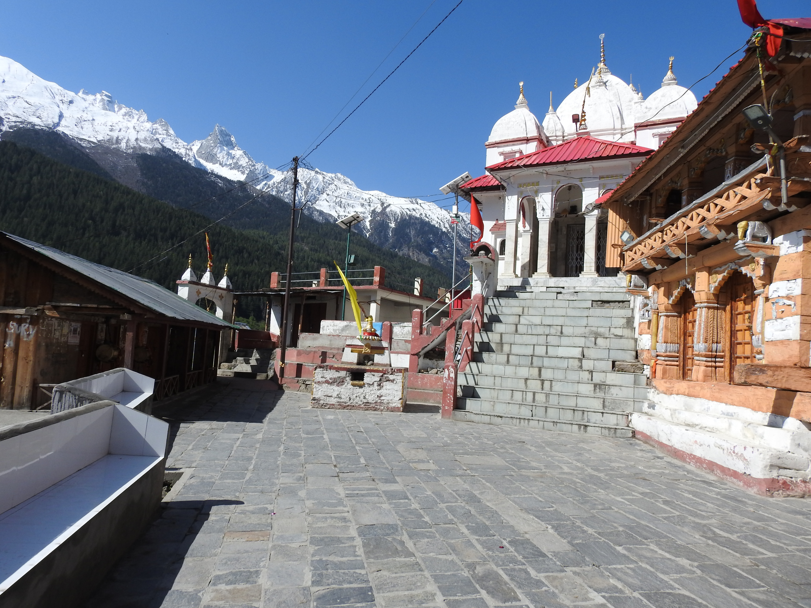
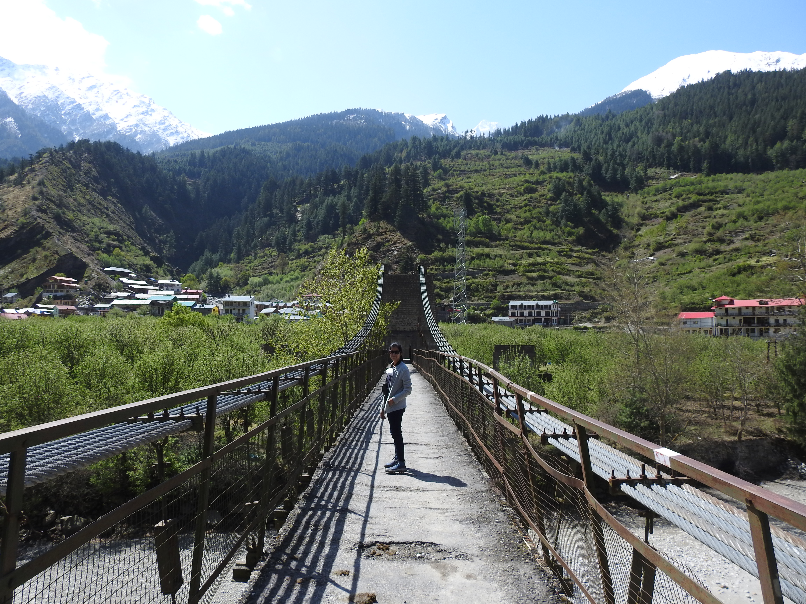
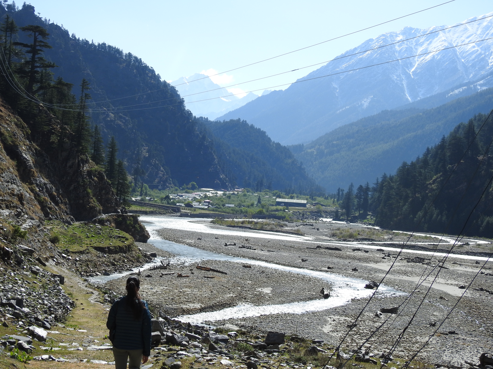
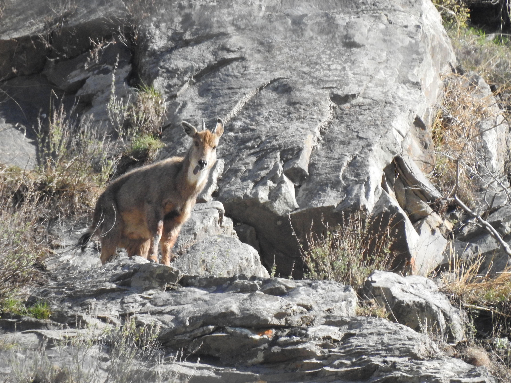

2022 was the year of fresh starts, for most of us, who have been confined to their homes for the past two years since the covid-19 pandemic.
We (Manjari and myself) had a mildly productive year in 2021, and managed to submit our respective Doctoral theses for review.
As we wrapped up the rest of our academic obligations we had a little window of opportunity to visit Harsil in Uttarakhand.
We came to know of Harsil from our friend, Dr. Ankita Sinha, who studied riverine birds and their ecology along several Himalayan rivers and had intimate knowledge of Harsil.
Over the years, she would tell us about the rare birds she had encountered in that area.
Unfortunately, we could not find time from our own field obligations to visit this beautiful valley.
A long weekend holiday of four days was round the corner, and we wanted to make good use of it.
We packed our bags and called Ankita to let her know of our plans.
She graciously communicated with her local contacts and arranged for hotel rooms at discounted prices for us.
Mr. Asif from Turner road, agreed to drop us at Harsil for INR5500, which was quite deal since most of the other drivers were quoting figures close to twice the amount.
We started our journey from Dehradun at 6am Thursday, April 14.
The distance to Harsil is about 250 kilometers, since most of the road is through hilly regions that translates to about the same as travelling 500kms on the plains.
Thankfully we had an early start.
Mr. Asif is a long time resident of Dehradun and on the way to Harsil he narrated several stories of his exploits and kept us entertained.
Like typical Doonites, the three of us had a wonderful time blaming everyone else for ruining and polluting the beautiful valley.
Our conversations started from the lost green cover of Dehradun to the unsightly expansion of the city that all of us have grown to love.

### Birds

Everyone has different priorities for choosing their vacation spots.
We have two primary criteria, the location should not be overtly touristy, and it should have good spots for birding.
Harsil falls on the circuit of the char-dham yatra, and during that time the place is flooded with pilgrims from all over the country trying to score brownie points with their respective saviours.
We planned our trip before the commencement of the Char-dham yatra and hence had a chance to experience the tranquility of the region.
Harsil is a great place to spot some rare himalayan birds and we have been told so by several of our colleagues at Wildlife Institute of India.
The trip to Harsil has been planned and cancelled several times by now due  to unforeseen exigencies so it was a now or never moment for us.

We had seen beautiful himalayan villages before during our trekking trips around uttarakhand, but nothing prepared us for the beauty of Harsil.
We spent every waking moment awestruck by the majesty of vast snow-clad himalayan peaks.
It was humbling to grasp that the life-giving Ganga has its origins nearby and

#### Coal tit

#### Water pipit

#### Grey wagtail

{width="706"}

#### Brown Dipper

#### IBISBILL

#### European Goldfinch

#### Siberian Stonechat

### The Views

Birds aside, Harsil is a beautiful place.
The village of Harsil falls on a ancient trade route that connects India with Tibet.
The ancient villages of Harsil, Mukba, and Jhala still have old routes that connect it to surrounding countries.
First day of the trip we set out to visit the village of Mukhba/Mukba.
The Hindu diety Ganga who is the embodiment of the Holy river Ganga that nurtures major parts of India has her primary temple at Gangotri.
During the Char-dham yatra pilgrims come to visit Ganga and seek her blessings.
For most parts of the year, the statue of the diety stays in Gangotri, and it is shifted to Mukhba during the harsh winter months.
When we were visiting Harsil, the diety was presiding at Mukhba and we had the golden opportunity to get her blessings.

{width="674"}

After visiting the temple, we crossed a bridge to village of Dharali.
While Mukhba is situated higher up on one side of the hill, Dharali is at the same level as the river and has numerous apple orchards.

{width="681"}

The road from Harsil goes to Gangotri via Dharali, so it was a brisk walk back to Harsil.

### Day 2

This day we decided to go off the beaten track and scout some potential birding hotspots near Harsil.
As we were walking from Harsil to the small hamlet of Bagori, we found a well-laid trail on our right.
A little google search revealed that this was the famous Kyarkoti trek, that is relatively unexplored and provides an excellent high-altitude valley trek option for people who want to avoid the crowd at Valley of flowers.

We found some excellent homestays at Bagori Village.
One of the homestay owners quoted about 1500 inr per day per room which included breakfast and dinner.
Bagori is an excellent option for people who want to experience a traditional homestay experience at a himalayan village.
The village is very well-maintained and a must-visit because it is right next to the Bhagirathi river and provides excellent views of the Kalanag mountain and is surrounded by apple orchards.
I can only imagine, how beautiful this place would look on a moonlit night when apple trees are in full blossom.

This day we were on the quest to find the Ibisbill, but unfrotunately, despite walking back and forth about 12kms we could not sight that bird.

### Day3

This was our last day at Harsil and our cab was to arrive from Dehradun at 10am to get us back home.
We did not waste precious daylight and started the morning search for the ibisbill at 7am.
By 8am we had crossed the border of Bagori village and on our way to the Jhala village.
We were walking on a ancient trade route that connected Uttarakhand with Himachal Pradesh.
The road was rocky but wide, it hugged the bhagirathi as it snaked its way around the mountain.
As we were walking down that road, we could not help ourselves wondering how men and animals must have used this road for hundreds of years before us.
We were having a lively conversation about the beauty of Harsil and how we must visit this place at least once a year.
Then suddenly, Manjari spotted a Ibis bill nesting on a river island.
The back plumage of the bird was camouflaged by the rounded rocks of the river island.
Kudos to her, we were able to spot it and that truly was the cherry on top of the cake.

With the ibis bill deeply etched in our memories, we continued walking down the road, hungry for more rare sightings.
The day before we had heard one restaurant owner recount how gorals are a common sight in this area and very easy to spot if one keeps their eyes peeled.
While Manjari was scanning the river bed for more birds, I had my eyes set on the rocky cliffs.

{width="670"}

As luck would have it, we spotted two gorals browsing on the steep cliffs above us and thanks to the Nikon P900, we also managed to get some great shots of these majestic bovids.
If we had more time, this would have been a great day filled with surprises and missed breakfast and lunch.
However we were on the clock.
Like the kid trying to mug up outside the examination hall, we tried to spot as many birds, animals, insects as we could.
Three days and one trip is just not enough to experience Harsil.

It was 10am, our cab would be arriving anytime now, so with a heavy heart we headed back.
We had a short breakfast with our cab driver before starting off, it would be 7pm before we reached home.
Harsil, which seemed like a distant place till a few days back, was now etched in our minds.
I can close my eyes and be there in an instant.
As we were heading back we knew, we had to come back for the conversations and sojourns left unfinished.
