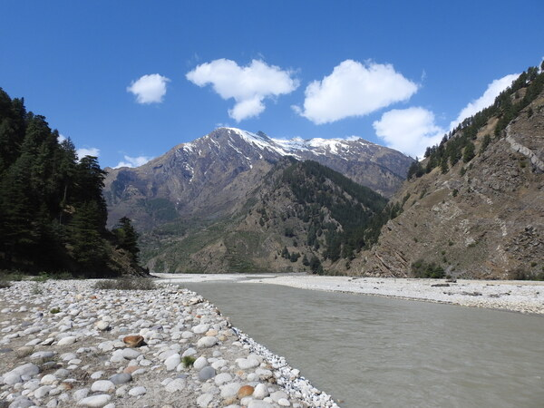
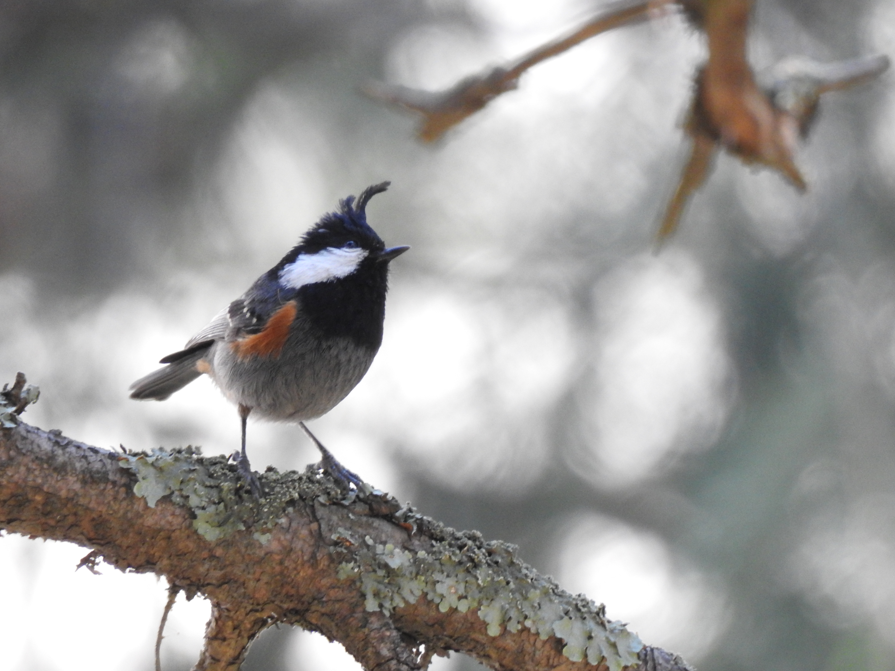
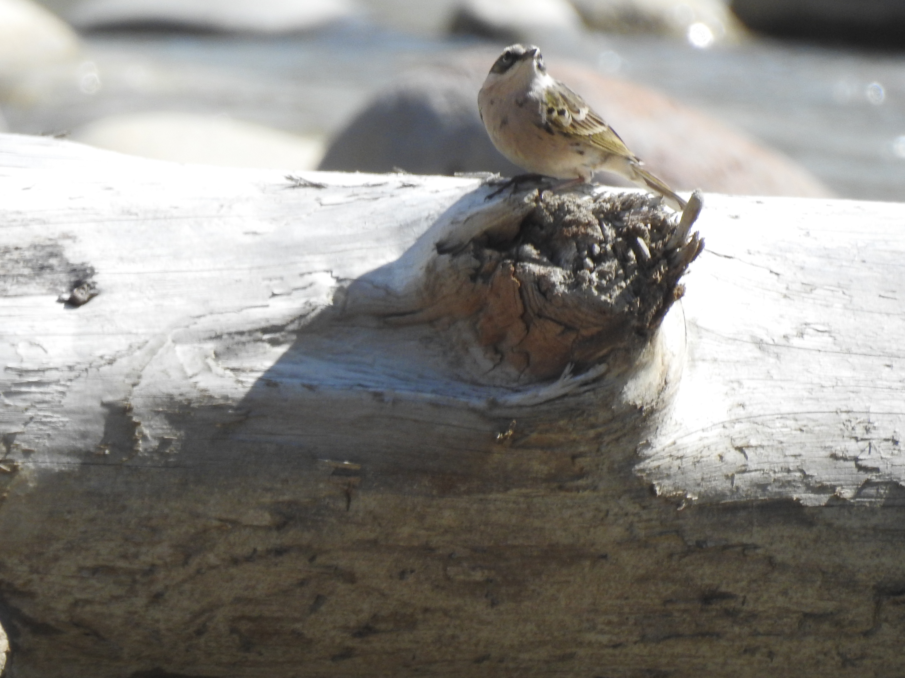
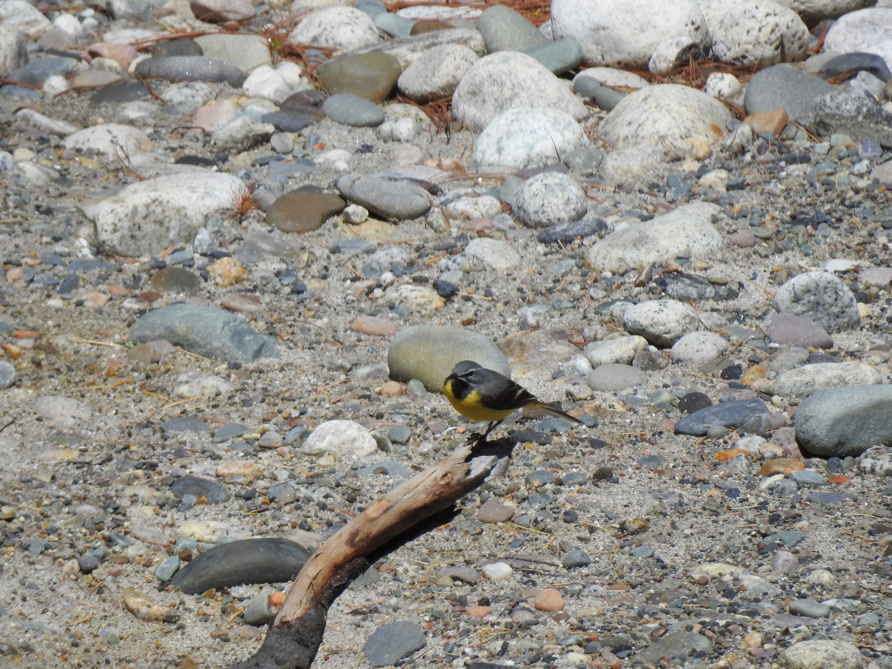
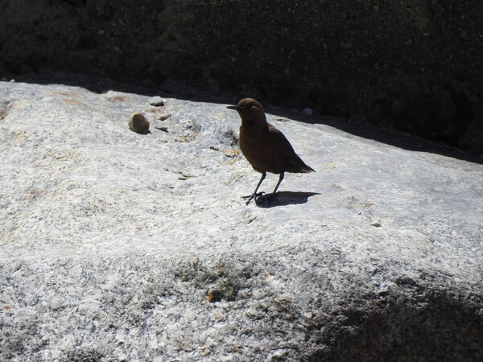
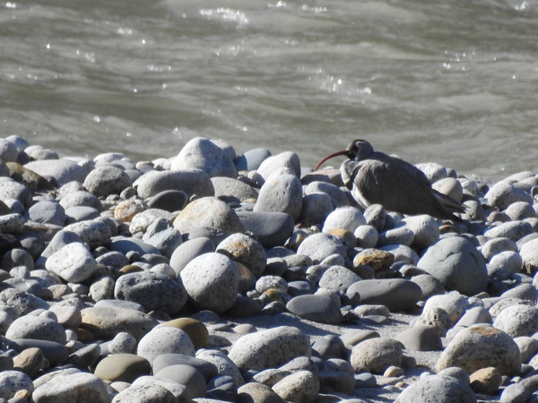
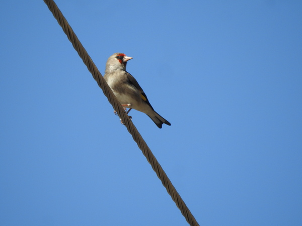
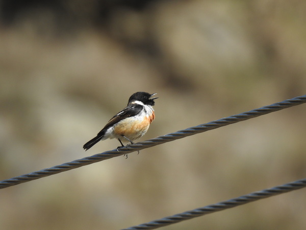

2022 was the year of fresh starts, for most of us, who have been confined to their homes for the past two years since the covid-19 pandemic.
We (Manjari and myself) had a mildly productive year in 2021, and managed to submit our respective Doctoral theses for review.
As we wrapped up the rest of our academic obligations we had window of opportunity to visit Harsil.
We came to know of Harsil from Ankita Sinha, who studied riverine birds and their ecology along several Himalayan rivers and had intimate knowledge of Harsil.
Over the years, she would tell us about the rare birds she had encountered in that area.
Unfortunately, we could not find time from our own field obligations to visit this beautiful valley.
Anyway, so there was a long weekend holiday of four days and we thought it will be a shame to waste it sitting in Dehradun.
We packed our bags and called Ankita to let her know of our plans.
She graciously communicated with her local contacts and arranged for hotel rooms at discounted prices for us.
Next we called up local cab owners and arranged for a pickup and drop deal.
Mr. Asif from Turner road, agreed to drop us at Harsil for INR5500, which was quite deal since most of the other drivers were quoting figures close to twice the amount.
We started our journey from Dehradun at 6am Thursday, April 14.
The distance to Hrsil is about 250 kilometers but most of the road is through hilly regions and hence it translates to about the same as travelling 500kms on the plains.
Thankfully we had an early start.
Mr. Asif was a long time resident of Dehradun and on the way to Harsil he narrated several stories of his exploits and kept us entertained.
Like typical Doonites, the three of us kept on blaming everyone else for ruining and polluting the beautiful valley.
Our conversations started from the lost green cover of Dehradun to the unsightly expansion of the city that all of us had grown to love.

### Birds

#### Coal tit

#### Water pipit

#### Grey wagtail

{width="706"}

#### Brown Dipper

#### IBISBILL

#### European Goldfinch

#### Siberian Stonechat

